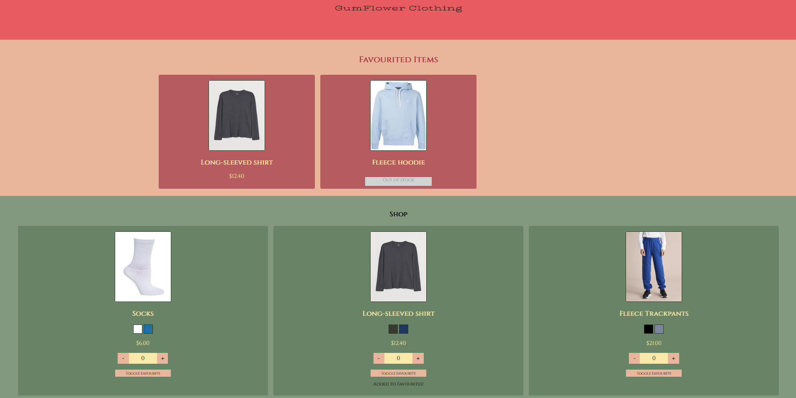

# E-Commerce Website (React)

## Clothes E-Shop configured using React.

## Design & Styling

The colour palette, as always, was based on Australian flora - in this case, gum tree flowers. I tried to use contrasting colours to make the page more eye-catching to the users, with the differing colours clearly representing different parts of the page.

## Layout

There is a homepage with a welcome message and there is a product list page which contains all of the product cards. Eventually, I would like there to be a cart page which updates with user input (I have added the link here but not the logic etc. that goes with it.)

You can click on any of the cards on the Product List page to go to a specific clothing item, where you can find more information. At the moment, you can only add to favourites or add to cart on the homepage.

## Logic

There is some logic incorporated into this app - favourited items will appear in the favourite items catalogue at the top of the product list page. This needs to be a rotating carousel.

## Things to be added

### MVP Items

-   Rotating carousel
-   Updating items in cart and favourites on click, instead of on refresh
-   Ability to add specific colours to cart, and adding to cart/favourites from Product Page screen.

### Extension Items

-   Adding a cart with logic
-   Stopping people from adding -1 of an item to their cart
-   Changing the url input in the database to be an array and mapping out the images in the product page.
